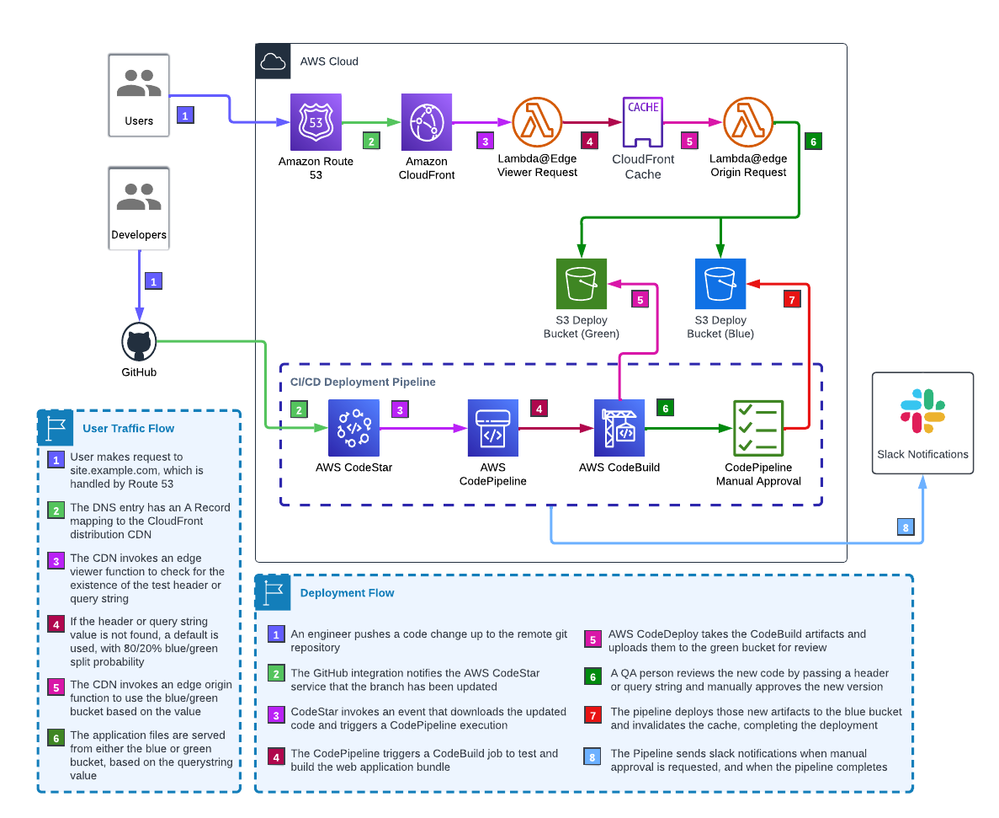

# Website Pipeline Infrastructure Project

This is a project for CDK development with TypeScript. It is used for deploying a web page with a Blue/Green pipeline. The React project lives in the root directory and the CDK project lives in the `./infra` subdirectory as an independent node.js project.
 
It depends on the following resources being available:

- A GitHub repo with these contents
- A CodeStar connection to GitHub
  - This triggers the build when branches are pushed
  - Setup directions included below
- An environment variable file (`.env`) with the following contents:
  - CODESTAR_ARN
  - DOMAIN_NAME
  - GITHUB_OWNER
  - GITHUB_REPO
  - SERVICE_NAME
  - SLACK_WORKSPACE_ID (optional)
  - SLACK_CHANNEL_ID (optional)
  - See `.env.example` for an example you can copy/paste
- If you are using the Slack integration, you will need to set up an AWS ChatBot
  - Setup directions below

## Architecture



## Deployment

The app is deployed to an environment, which maps to a combination of the following

- An AWS Account
- An AWS region (e.g. "us-east-1")
- A `$CDK_ENV` environment (e.g. "dev")

There exists a mapping between the `$CDK_ENV` and the git branch containing the code that will be deployed. Currently there are two mappings:

- `$CDK_ENV` == 'dev' - GitHub branch 'dev'
- `$CDK_ENV` == 'prod' - GitHub branch 'main'

You may add as many mappings as you like, and setting the `$CDK_ENV` environment variable before initial deployment will set the pipeline to automatically deploy the mapped branch on update. You can create additional mappings, e.g.

- `$CDK_ENV` == 'test' - GitHub branch 'test'
- `$CDK_ENV` == 'pdamra' - GitHub branch 'pdamra'

## Deployment Process

### Stage 1: Source

This stage is triggered by GitHub upon a push. When triggered, it downloads the most recent version of the configured branch and packages it as an input artifact for the pipeline.

#### CodeStar Connection Setup

- AWS Management Console -> CodePipeline -> Settings -> Connections -> Create Connection
- Select provider (GitHub)
- Connection Name (e.g. DevAccountGitHubConnection)
- "Install a new app"
- Authenticate with GitHub
- Select the repo to connect (returns you to AWS)
- "Connect"

### Stage 2: Build

This stage is a CodeBuild project that executes the steps needed to build the website, e.g.

- `npm ci`
- `npm test`
- `npm run build`
- Any other shell commands you need to make the deployment bundle

When the build is completed successfully, the bundled files are collected into an output artifact.

### Stage 3: Deploy Green

Green represents the new source code deployment. The metaphor is new green grass growing

This stage deploys the green side of the S3 origin. It takes the output artifact and copies the files to the green bucket. It then invalidates the CloudFront cache for the green bucket so that the new files can be served to users who are targeted as "green". Finally, it pauses pipeline execution until a manual approval process is complete.

### Stage 4: Deploy Blue

Blue represents the existing source code deployment. The metaphor is frozen/ice

Once the acceptance testing on the green version is successful, an engineer can click the "Review" button on the CodePipeline console, and then click "Approve". This will trigger a deployment to the green bucket. Once the new files are written to the bucket, the cache is again invalidated, and the new files are served to all users.

## Testing / Selecting Blue or Green

By default, web requests are randomly assigned to the green or blue S3 origin bucket. The assignment logic is that a request has an 80% chance of being directed to the blue bucket. The contents of the blue and green S3 buckets will be identical, unless a deployment is in process. In that case, the new versions of the files will be stored in the green bucket until the have received a manual approval.

It is possible to manually select the blue or green bucket. This can be done in two ways:

- By passing a header in the HTTP request
  - This can be accomplished with tools like the ModHeader Chrome browser extension.
  - Pass the header `x-blue-green-context` with a value of`blue` or `green`
- By adding a the querystring `blue_green` to the url with a value of `blue` or `green`
  - e.g. `?blue_green=green`
  - When you add the querystring param it will redirect, and the query string will disappear
  - IMPORTANT - Reload once more to view the new version

### Testing Workflow

1. A deployment is triggered by a push to GitHub
2. When the deployment to the green bucket is complete, the pipeline pauses, waiting for manual approval
3. The tester would then use the ModHeader Chrome browser extension to add the header `x-blue-green-context` with a value of "`green`", or uses the querystring `?blue_green=green`
4. Now the tester will see the new version of the site when they visit the URL (may need to refresh)
5. If problems are found, the version can be rejected and deployment stopped by selecting "Reject" in the CodePipeline console. Then, steps 1-4 can be repeated
6. Once approved, the tester clicks the "Review" button in the CodePipeline console, and the new files are deployed to the green bucket, and displayed to all users

## Pipeline Event Notifications

If the `SLACK_WORKSPACE_ID` AND `SLACK_CHANNEL_ID` environment variables are provided, a `SlackChannelConfiguration` resource and `NotificationRule` will be created and assigned to the pipeline using an AWS ChatBot Client application.

### Chatbot Client Setup

These steps must be completed before attempting to set up notifications using this stack.

- https://console.aws.amazon.com/chatbot/
- Configure a chat client -> Slack -> Configure Client
  - Redirects to Slack OAuth screen -> Allow
- On Workspace Details page, you'll be presented with options:
  - Configure new channel
  - Create configuration using CloudFormation templates
- We will define in CDK in this stack
- Add workspace ID and slack channel ID to .env file
  - Workspace ID on Workspace Details page
  - Channel ID in Slack, in dropdown menu under #channelname heading up top
- Add a `SlackChannelConfiguration` to the stack
- Add an SNS `Topic` to the stack
- Add the topic to the `notificationTopics` property of the configuration
- In the slack channel, invite `@aws`
- In AWS Chatbot console -> Configured Clients -> Slack Workspace: my-project or whatever
  - Select "Send test message"
- Did it come through? I bet it did!

---

# Application Setup from Scratch

## Boilerplate

_Assumes you're using VSCode_

### Install Boilerplate React and CDK

```sh
# Create new front-end application (however you want, this is one example)
npx create-react-app spa-pipeline --template redux-typescript && cd spa-pipeline

# Make new VSCode project
echo '{"folders": [{"path": "."}],"settings": {}}' > spa-pipeline.code-workspace

git add . && git commit -am "VS Code workspace"

# Install CDK Infrastructure
mkdir infra && cd $_
npx cdk@2 init --language=typescript --generate only

git add . && git commit -am "CDK boilerplate"

# Rename default files for clarity
mv bin/infra.ts bin/website-infrastructure.ts
mv lib/infra-stack.ts lib/website-stack.ts
# Update ./infra/cdk.json so that the "app" property has a value of:
# "npx ts-node --prefer-ts-exts bin/website-infrastructure.ts",
git add . && git commit -am "Rename generated files"
```

### Install NPM Dependencies in Infra

```sh
# Inside ./infra, not at root
npm i --save-dev \
  @types/aws-lambda \
  @types/babel__traverse \
  @types/node \
  @types/prettier \
  @typescript-eslint/eslint-plugin \
  @typescript-eslint/parser \
  esbuild \
  eslint \
  eslint-config-prettier \
  prettier

npm i change-case dotenv

git commit -am "Adds infrastructure NPM dependencies"
```

### Add Configuration Files

#### Environment Variable Config

_Inside ./infra_

```sh
git add . && git commit -am "Update .gitignore to ignore .env files"

touch .env .env.example
```

Update `.env.example` to look like this:

```
CODESTAR_ARN="arn:aws:codestar-connections:us-east-1:XXXXXXXXXXXX:connection/01234567-aaaa-0123-0123-aaaa01234567"
DOMAIN_NAME="example.com"
GITHUB_OWNER="djheru"
GITHUB_REPO="spa-pipeline"
SERVICE_NAME="myapp"
SLACK_WORKSPACE_ID="XXXX"
SLACK_CHANNEL_ID="XXXXX"
```

Copy the same contents to the .env file. We will replace them with the real values later

```sh
# Ensure that the .env file is not present in source control
git status # VERY IMPORTANT! ENSURE THAT .env IS NOT PRESENT, ONLY .env.example
git add . && git commit -m "Add environment files"
```

#### Prettier and ESLint Configs

- `touch .eslintignore .eslintrc.json ../.prettierrc`

##### .eslintignore

```
# .estlintignore file
dist
build
node_modules/
```

##### .eslintrc.json

```
{
  "env": {
    "browser": true,
    "es2021": true
  },
  "extends": ["eslint:recommended", "plugin:@typescript-eslint/recommended", "prettier"],
  "overrides": [],
  "parser": "@typescript-eslint/parser",
  "parserOptions": {
    "ecmaVersion": "latest",
    "sourceType": "module",
    "project": ["./tsconfig.json"]
  },
  "plugins": ["@typescript-eslint"],
  "root": true,
  "rules": {}
}
```

##### .prettierrc

```
{
  "semi": true,
  "trailingComma": "es5",
  "singleQuote": true,
  "printWidth": 90,
  "tabWidth": 2
}
```

##### Update package.json Run Scripts

```
"lint": "eslint --ignore-path .eslintignore --ext .ts .",
"format": "prettier --ignore-path .gitignore --write \"**/*.+(js|ts|json)\"",
```

##### Update .tsconfig at Root of Project

Add `"exclude": ["infra"]`

##### Format and Commit

```sh
npm run format && git add . && git commit -am "Add linting and formatting"
```

## Infrastructure as Code

### Create Interfaces for Stack Props

#### Pipeline Props

Create a new file with `touch ./lib/website-pipeline.ts`. This is where the AWS resources for the CI/CD pipeline will be managed. We will create a type and two interfaces in this file:

##### Environment Type

This represents the environment where the stack will be deployed. Typically things like "dev", "prod", "test", "yourname". We'll be using dev here, but we correlate these to AWS CLI profiles to deploy to different accounts and/or regions

```ts
export type Environment = 'dev' | 'prod' | 'test' | string;
```

##### WebsitePipelineBaseProps Interface

These values are set from environment variables in at the entry point in ./bin/website-infrastructure.ts and passed through to the pipeline

```ts
export interface WebsitePipelineBaseProps {
  // Authenticates with GitHub to receive notifications of git activity
  codestarConnectionArn: string;
  // E.g. dev, prod, etc
  environmentName: Environment;
  // When this branch is updated, its code will be deployed
  githubBranchName: string;
  // GitHub user name
  githubOwner: string;
  // GitHub repository
  githubRepo: string;
  // Slack workspace for notifications
  slackWorkspaceId?: string;
  // Slack channel
  slackChannelId?: string;
}
```

##### WebsitePipelineProps Interface

These values are passed in from the parent stack, to obtain values that are specific to the stack, like the S3 buckets and distribution ID

```ts
export interface WebsitePipelineProps extends WebsitePipelineBaseProps {
  // The bucket containing the blue (live) files
  blueBucket: Bucket;
  // The bucket containing the green (new) files
  greenBucket: Bucket;
  // CloudFront distribution serving these files
  distributionId: string;
  // Full domain name
  fullDomainName: string;
}
```

#### Website Stack Props

Here we are working with `./infra/lib/website-stack.ts`

##### WebsiteStackProps Interface

These props pass the stack details like domain name, environment name, and service name, along with passing the pipeline props through to the pipeline stack as described above

```ts
export interface WebsiteStackProps extends StackProps {
  domainName: string;
  environmentName: Environment;
  serviceName: string;
  pipelineProps: WebsitePipelineBaseProps;
}
```

### CDK Application Setup

This is the makeup of the main CDK entry point, in `./infra/bin/website-infrastructure.ts`.

#### Imports

```ts
import { App, StackProps, Tags } from 'aws-cdk-lib';
import 'dotenv/config';
import 'source-map-support/register';
import { WebsitePipelineBaseProps } from '../lib/website-pipeline';
import { WebsiteStack } from '../lib/website-stack';
```

#### Loading Environment

This setup assumes that the `dev` branch in GitHub corresponds to the `dev` environment in AWS, and the `main` branch corresponds to the `prod` environment. We will be using 'dev' as the environment in this example. This means that the string `dev` will be used in the domain name for the website (e.g. `myapp.dev.example.com`) _unless_ the environment is 'prod', in which case it would be `myapp.example.com`. The environment name is also used in tags and labels throughout the stack, for names of resources, etc.

```ts
// These environment variables are loaded from the `.env` file if running locally,
// or from the CodeBuild environment.
const {
  // These AWS environment variables will be set for you in an AWS build environment
  // You need to make sure they are set in your environment when running locally
  AWS_DEFAULT_ACCOUNT_ID,
  AWS_DEFAULT_REGION,
  CDK_DEFAULT_ACCOUNT,
  CDK_DEFAULT_REGION,
  CDK_ENV: environmentName = '', // Dev is the only supported env ATM
  CODESTAR_ARN: codestarConnectionArn = '',
  DOMAIN_NAME: domainName = '',
  GITHUB_OWNER: githubOwner = '',
  GITHUB_REPO: githubRepo = '',
  SERVICE_NAME: serviceName = '',
  SLACK_WORKSPACE_ID: slackWorkspaceId = '',
  SLACK_CHANNEL_ID: slackChannelId = '',
} = process.env;

const githubBranchName = environmentName === 'prod' ? 'main' : environmentName;

const account = CDK_DEFAULT_ACCOUNT || AWS_DEFAULT_ACCOUNT_ID;
const region = CDK_DEFAULT_REGION || AWS_DEFAULT_REGION;

// We exit right away with an error if all of the environment variables are not set
// You can remove the slackWorkspaceId and slackChannelId if not using slack
if (
  ![
    environmentName,
    codestarConnectionArn,
    domainName,
    githubOwner,
    githubRepo,
    serviceName,
    slackWorkspaceId,
    slackChannelId,
  ].every((el) => !!el)
) {
  console.error('env vars: %j', {
    codestarConnectionArn,
    domainName,
    environmentName,
    githubOwner,
    githubRepo,
    serviceName,
    slackWorkspaceId,
    slackChannelId,
  });
  throw new Error('Missing environment variables!');
}
```

#### CDK Application Instantiation

Here we create the CDK application, which serves as the foundation for the resources.

```ts
const app = new App();

const stackProps: StackProps = {
  description: `Summary: This stack is responsible for handling the WebsitePipeline stack infrastructure resources.
Deployment: This stack supports deployments to the standard environments. The stack 
can be deployed to a custom environment (e.g. a developer environment) by ensuring 
that the desired environment name (e.g. ${environmentName}) is set in the $CDK_ENV environment 
variable`,
  env: { account, region },
};
```

#### Instantiating the Website Stack

```ts
const stackId = `${serviceName}-${environmentName}`;

const pipelineProps: WebsitePipelineBaseProps = {
  codestarConnectionArn,
  environmentName,
  githubBranchName,
  githubOwner,
  githubRepo,
  slackWorkspaceId,
  slackChannelId,
};

const websiteStack = new WebsiteStack(app, stackId, {
  ...stackProps,
  domainName,
  environmentName,
  serviceName,
  pipelineProps,
});
```

#### Adding Tags to the Resources

```ts
// Tag the stacks and all of the nested constructs
Tags.of(websiteStack).add('name', serviceName);
Tags.of(websiteStack).add('environmentName', environmentName);
```

### Website Stack Setup

This is `./infra/lib/website-pipeline.ts`. This file contains the following methods:

```ts
buildResources() {
  this.importHostedZone();
  this.buildCertificate();
  this.buildDeployBuckets();
  this.buildOAI();
  this.buildS3Origins();
  this.buildEdgeLambdas();
  this.buildDistribution();
  this.buildARecord();
  this.buildPipeline();
}
```

See the implementation of these methods for details.

### Website Pipeline Setup

This is `./infra/lib/website-pipeline.ts`. It contains the pipeline logic to deploy the application in response to pushes to github branches. It also uses the functions defined in `./infra/lib/pipeline-actions.ts` to build the customized pipeline actions.

```ts
buildResources() {
  this.buildPipeline();
  this.buildSourceStage();
  this.buildBuildStage();
  this.buildGreenStage();
  this.buildBlueStage();
  if (this.props.slackChannelId && this.props.slackWorkspaceId) {
    this.buildNotificationTopic();
    this.buildSlackChannelConfiguration();
    this.buildSlackNotifications();
  }
}
```

See the implementation of these methods for details.

### Lambda Functions

The lambda functions used to control the blue/green response logic live in `./infra/src/handlers`. These functions are used to check for the blue/green header/cookie/querystring and route traffic accordingly.
